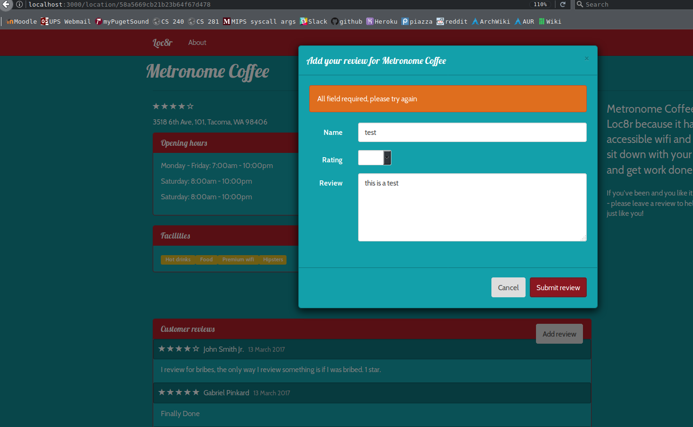
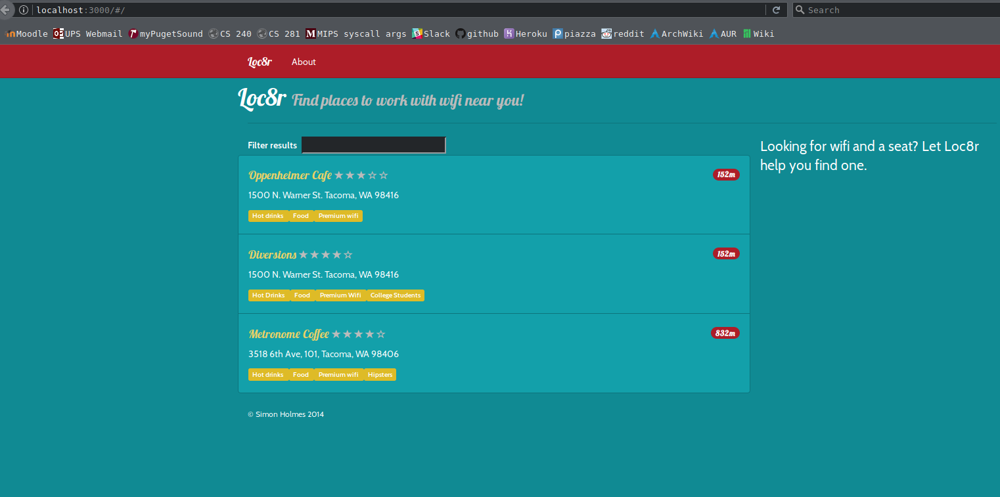
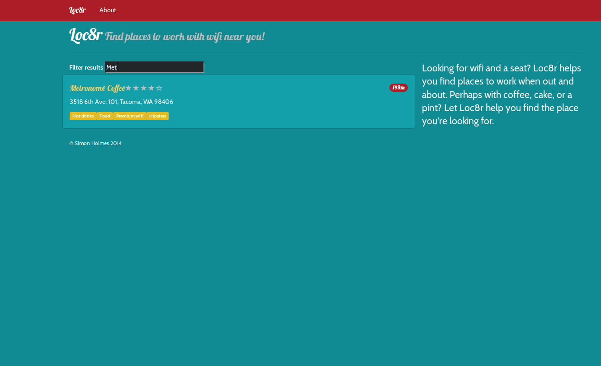
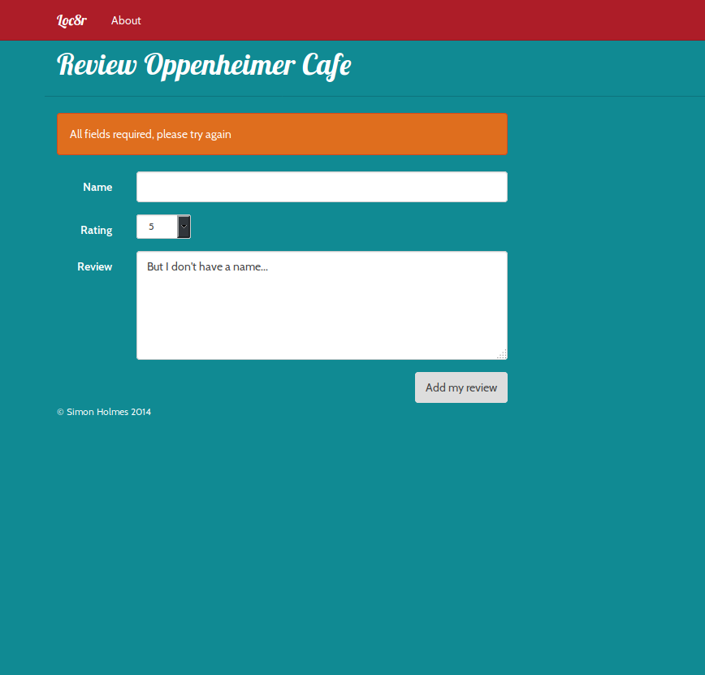
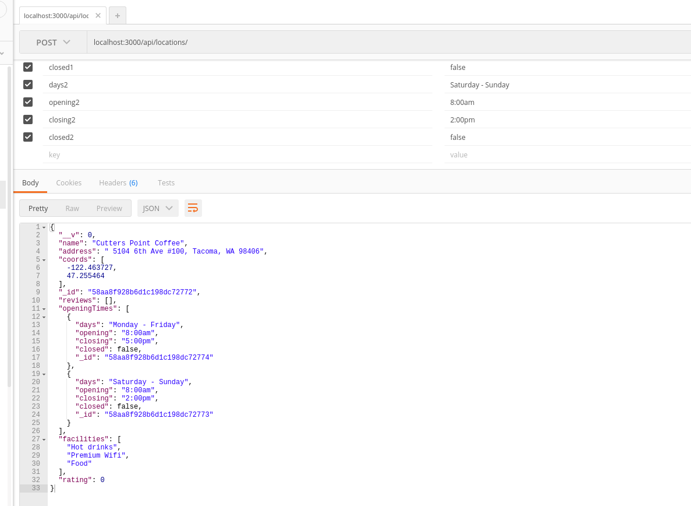
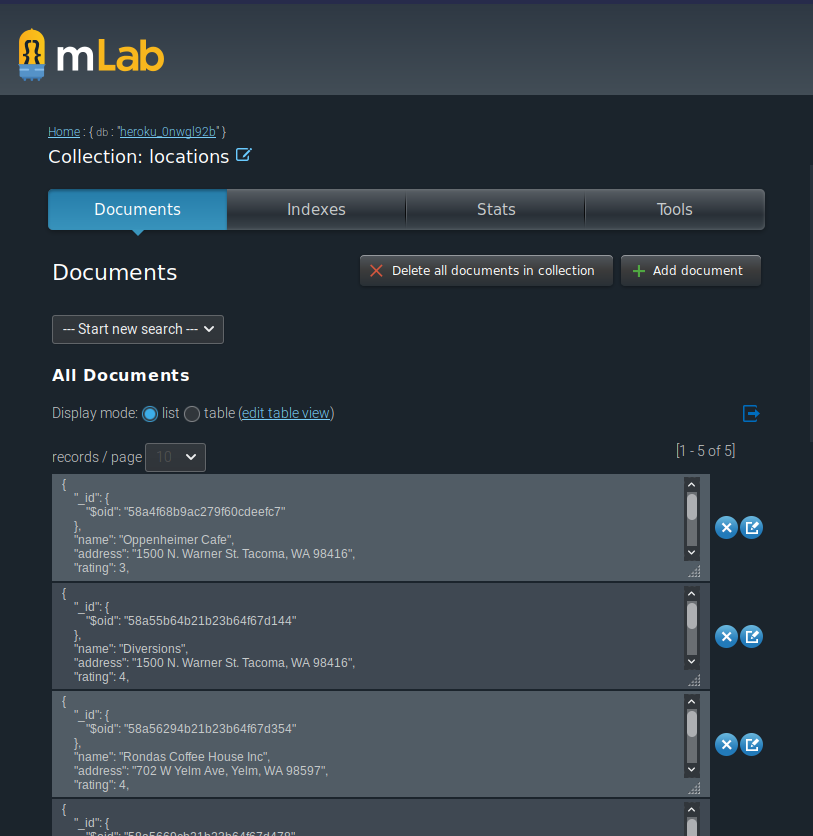

## README

Chapter Ten

live application link: <a href="https://cryptic-scrubland-30222.herokuapp.com/">Heroku</a>

In this chapter we took took all of the application code and made it run from the client. Additionally we used the AngularUI component
modal for the review form, handles post requests to the API using the http service, implemented HTML5 history API, and adding multiple
views to the application. While this chapter was rather long, I did not run into any issues, most of it was just copying code and heading
Professor Mullens README notes. Here is a picture of the modal view with a warning for an incorrectly formatted review:

Chapter Nine

live application link: <a href="https://cryptic-scrubland-30222.herokuapp.com/">Heroku</a>

In this chapter we replaced Express with Angular routing to deliver pages, attached views and controllers to routes and seperated files, instead
of having one big file that controlled various different functions (geolocation, distance, rating stars etc), we broke them up and put them into
their own individual folders. We also minified the application using uglify-js to make it more compact. Initially I had issues with this chapter.
This arose from the fact that I used var blah = function () {  instead of function blah () {. When Professor Mullen pointed this out I was able to
get the application working. Here is a screenshot of it in its current state:

Chapter Eight

live application link: <a href="https://cryptic-scrubland-30222.herokuapp.com/">Heroku</a>

Finished chapter eight, initially I had issues with this chapter. I accidentaly mistyped the name for a file, and everything was broken until
Professor Mullen pointed it out. After I got that fixed it was mostly smooth sailing. In this chapter we implemented a search bar, and did a
lot of back end stuff with angular. Here is a screenshot of the application:

Chapter Seven

live application link: <a href="https://cryptic-scrubland-30222.herokuapp.com/">Heroku</a>

Finished chapter seven. In this chapter we implemented various API's, finished the review screen, and the distances for the various locatons.
This chapter was quite challenging. For a while I was having an error where my localhost application was working fine, but when I went to my
live heroku app, the page would display "API lookup error". I resolved this by removing a / from the end of apiOptions.server in locations.js
Here is a picture of the application working:

Chapter Six

live application link: <a href="https://cryptic-scrubland-30222.herokuapp.com/">Heroku</a>

Finished Chapter Six. In this chapter we built the api for getting, posting, putting, and deleting. I had a little difficulty with this chapter,
but per usual it was my negligence. The first issue I had was that I did not realize that I had to include temp functions for all the ctrl functions,
a stark reminder not to code at 1:00am. This led to a few frusterating errors, but I was able to iron them out eventually. After that it was just
copying code from the book. Enjoy this lovely picture:

Chapter Five

live application link: <a href="https://cryptic-scrubland-30222.herokuapp.com/">Heroku</a>

Finished chapter five. In this chapter we worked with Mongo to start building the database. This process was harder than it had to be, I made a mistake
early on, by accident I created two mLab databases using the Heroku plugin. Once I sorted that out it was smooth sailing for the most part. Since this
chapter did not focus on the website, I am not certain whether I did everything correctly, as I had no way of viewing my progress. However I was able to
push the documents from my local database to mLab, so I am fairly certain everything is working as it should. Robomongo proved to be a very useful tool.
Here is a picture of my control panel on mLab:

live application link: <a href="https://cryptic-scrubland-30222.herokuapp.com/">Heroku</a>

Chapter Four

Finished chapter four. In this chapter we implemented various screens, and set up the various screens required for the app (reviews, location info, etc.)
The only real issue I had was trivial and quickly remedied: my map was not showing, but this was due to a mistake in indenting in one of the .jade files.
Other than that it went smoothly. The typo occured on page 99. The book used a .js file extension instead of a .jade one. Using this extension would crash
the program. Here is a screenshot of the info page:

Chapter Three

live application link: <a href="https://cryptic-scrubland-30222.herokuapp.com/">Heroku</a>

Finished the chapter 3 tutorial. Heroku application is now up and running. The whole process did not go as smooth as I initially thought it was going to be. After getting bootstrap and jQuery installed I tried to launch the app using nodemon. This did not work. After discovering a few errors, remedying them, and finding that my app still did not work, I restarted the project. Same problem. It looked like this:

Finally discovered that I had somehow managed to download the wrong version of bootstrap. After fixing that the app worked perfectly. Then it was just a matter of setting up and pushing it to heroku. Here is a screenshot of it working:

