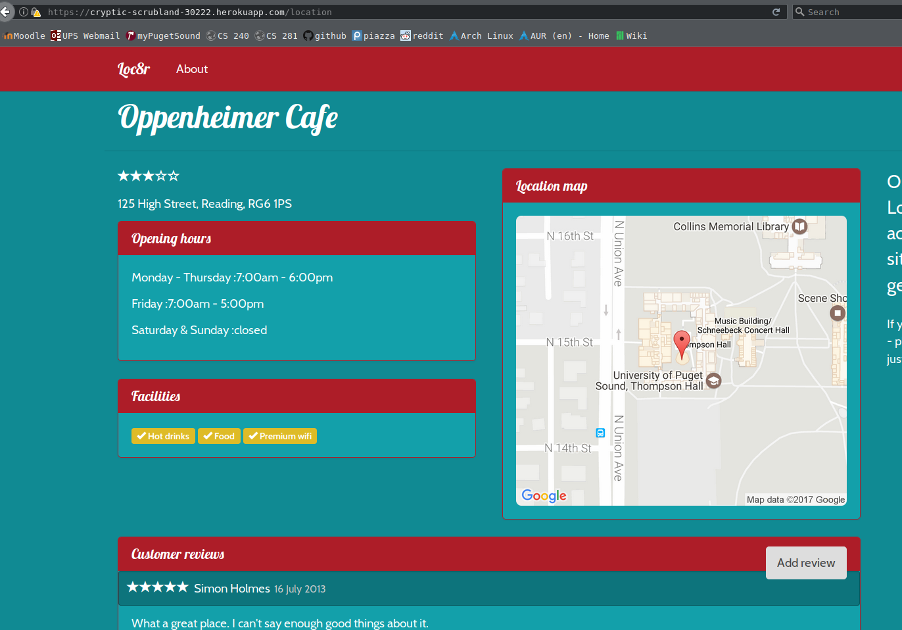
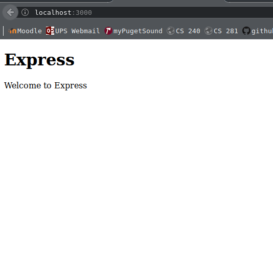
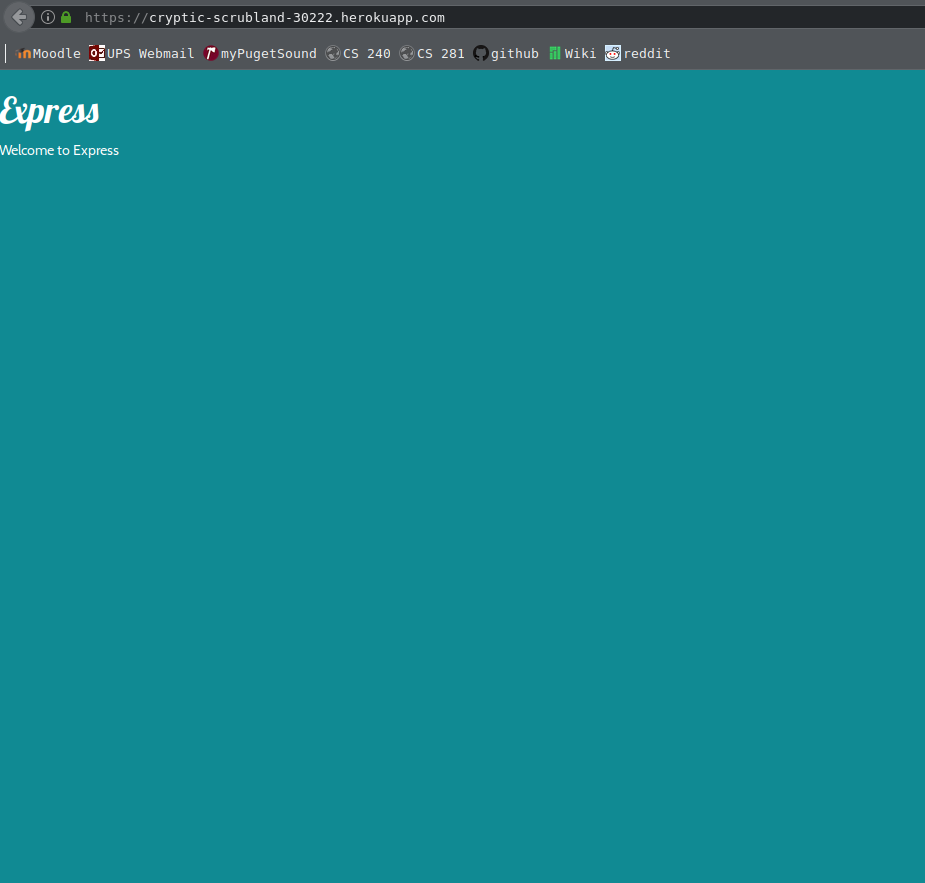

## README
live application link: https://cryptic-scrubland-30222.herokuapp.com/

Chapter Four

Finished chapter four. In this chapter we implemented various screens, and set up the various screens required for the app (reviews, location info, etc.)
The only real issue I had was trivial and quickly remedied: my map was not showing, but this was due to a mistake in indenting in one of the .jade files.
Other than that it went smoothly. The typo occured on page 99. The book used a .js file extension instead of a .jade one. Using this extension would crash
the program. Here is a screenshot of the info page:

Chapter Three

Finished the chapter 3 tutorial. Heroku application is now up and running. The whole process did not go as smooth as I initially thought it was going to be. After getting bootstrap and jQuery installed I tried to launch the app using nodemon. This did not work. After discovering a few errors, remedying them, and finding that my app still did not work, I restarted the project. Same problem. It looked like this:

Finally discovered that I had somehow managed to download the wrong version of bootstrap. After fixing that the app worked perfectly. Then it was just a matter of setting up and pushing it to heroku. Here is a screenshot of it working:

